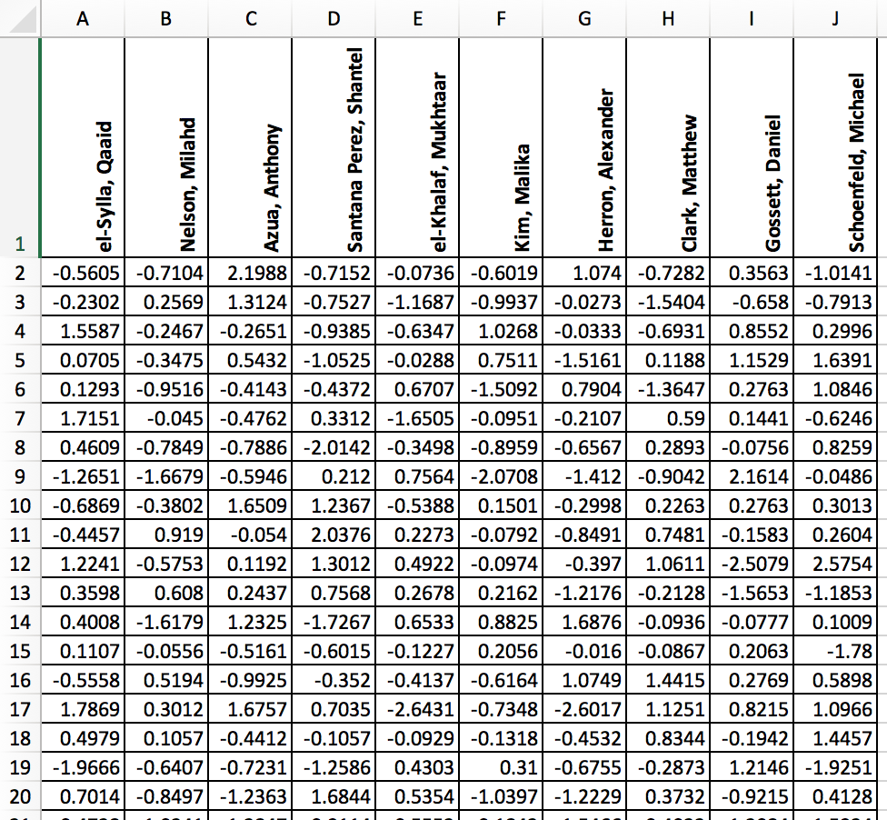
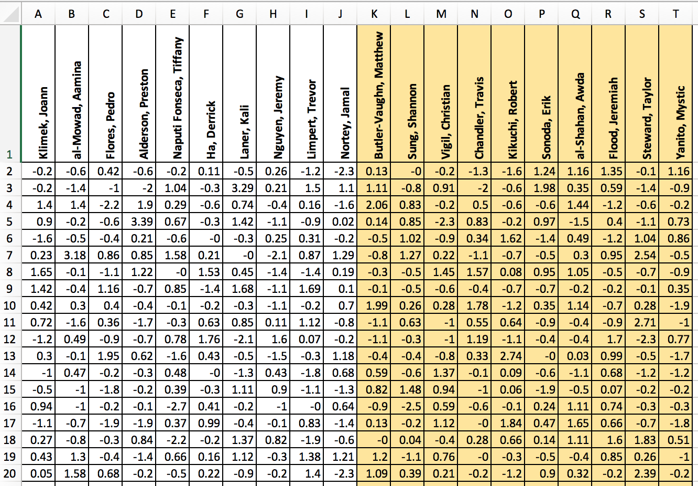
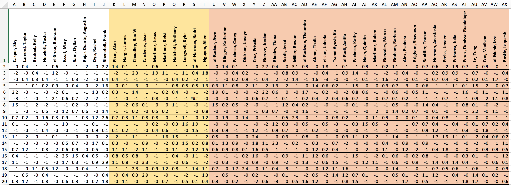

Future-proofing CSV Column-creep with the `janitor` Package
========================================================
author: Matt Pettis
date: 2018-10-18
autosize: true

Who I Am
========================================================

- Principal Data Scientist, Honeywell
- R user, since about 2010, according to the internet

Check these features
========================================================

... Now these features
========================================================

Moar features !!1!
========================================================

You'll probably keep getting more columns, tbh
========================================================
incremental: true

***
- It's a problem
- ... beause you hand-changed the column names.
- ... and there's got to be a better way...

Say...
========================================================
incremental: true

***

... there's an easy, programatic way to do this?

To the notebook!

